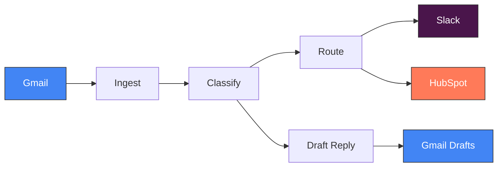

# mailwise

**Intelligent email triage powered by LLMs — classify, route, and draft responses automatically.**

<!-- GitHub About: AI-powered email classification and routing system. Full-stack: FastAPI + React + Celery + PostgreSQL. LLM-driven triage, automated routing, CRM sync, smart drafts. 2100+ tests, 93% coverage. -->
<!-- Topics: python, fastapi, react, llm, email-automation, celery, postgresql, docker, ai-engineering -->

[](https://github.com/jppuche/mailwise-ai-email-automation/actions)


## The Problem

Organizations drown in email. Manual triage wastes hours per shared inbox per day, SLAs slip because urgent requests sit behind newsletters, routing rules live in people's heads (and leave when they do), and customer interactions never make it back to the CRM. The bottleneck isn't volume — it's classification accuracy and integration with the tools teams already use.

## How mailwise Solves It

- **LLM-powered classification** with multi-provider support (OpenAI / Anthropic / Ollama via LiteLLM) — no vendor lock-in, switch models via config
- **Heuristic fallback** when LLM is unavailable — graceful degradation, not failure
- **5-layer prompt injection defense** — because email content is untrusted user input flowing into LLM context
- **Configurable routing rules** with 6 condition operators — business logic stays with business users
- **Auto-draft generation** — LLM drafts responses using org context, humans review before sending
- **CRM sync** (HubSpot) — idempotent 6-operation chain, no duplicate records
- **Slack notifications** — Block Kit rich messages with classification details, not just text dumps



## AI Engineering Decisions

These are the decisions that shaped the AI architecture — not just what was built, but why.

### Why multi-provider LLM (LiteLLM) over direct OpenAI SDK

Vendor lock-in is a real risk when your core classification depends on a single provider. LiteLLM provides a unified `completion()` interface across OpenAI, Anthropic, and Ollama. When GPT-4o broke our JSON parser mid-sprint, we switched to Claude Sonnet in one config change — zero code modifications. Different models serve different roles: cheap/deterministic for classification (temperature 0.1), capable/creative for draft generation (temperature 0.7). Local Ollama for development means no API costs during testing.

[Decision log entry →](docs/DECISIONS.md)

### Why heuristic fallback exists alongside the LLM

LLMs fail. Rate limits, provider outages, malformed responses — production systems can't afford "service unavailable" for email triage. A rule-based heuristic classifier covers common patterns (invoices, support requests, newsletters) when the LLM is down. This isn't a backup plan — it's a design constraint: **any pipeline stage must degrade gracefully, not crash the chain.**

### Why 5 layers of prompt injection defense

Email content is user-controlled text flowing directly into LLM context. A single sanitization layer isn't enough. mailwise implements defense in depth:

1. **Input sanitization** — Strip control characters, normalize encoding
2. **Defensive prompt engineering** — System prompts instruct the model to ignore embedded instructions
3. **Data delimiters** — Email content wrapped in explicit boundary markers
4. **Output validation** — LLM output validated against DB-backed category enums (not free-form text)
5. **No tool access** — Classification runs without tool/function-calling capabilities, minimizing attack surface

Each layer catches what the previous one misses.

### Why Celery pipeline over async-only processing

The email pipeline has 5 stages (ingest → classify → route → CRM sync → draft). Each stage is an independent Celery task that:

- **Commits to DB before passing to the next stage** — a Slack outage during routing doesn't lose the classification
- **Retries with exponential backoff** — transient failures resolve without intervention
- **Lands in a specific error state on failure** — debuggable, not a black hole
- **Is independently observable** — Celery's monitoring tools show exactly where emails are stuck

An `asyncio.gather()` approach would be simpler, but it loses persistence (tasks die with the process), retry granularity, and observability. For a production email system, those aren't optional.

## Architecture

**Adapter pattern for all integrations** — Gmail, Slack, HubSpot, and LiteLLM each sit behind an abstract base class. Swapping Gmail for Outlook, or Slack for Teams, means implementing one class. Zero changes to business logic.

**DB-enforced state machine** — Emails transition through 12 explicit states (FETCHED → SANITIZED → CLASSIFIED → ROUTED → ...). State transitions are enforced at the database level via enum columns — no state skipping, no implicit ordering.

**Type safety at every boundary** — Pydantic models at API boundaries, typed dataclasses at adapter boundaries, auto-generated TypeScript types for the frontend. No `dict[str, Any]` crossing layer boundaries.

**Redis does three jobs** — Message broker for Celery, classification cache for deduplication, and refresh token store for JWT auth. One dependency, three capabilities.

## Quick Start

```bash
git clone https://github.com/jppuche/mailwise-ai-email-automation.git
cd mailwise
cp .env.example .env    # Edit with your API keys
docker compose up -d    # All 6 services start with health checks
```

Dashboard: [http://localhost:5173](http://localhost:5173) | API docs: [http://localhost:8000/docs](http://localhost:8000/docs)

See [Deployment Guide](docs/deployment.md) for production setup, environment variables, and troubleshooting.

## Tech Stack

| Layer | Technology |
|-------|-----------|
| **API** | FastAPI, SQLAlchemy 2.0 (async), Pydantic v2 |
| **Frontend** | React 19 + Vite + TypeScript, Tailwind CSS v4 + shadcn/ui |
| **AI/ML** | LiteLLM (OpenAI / Anthropic / Ollama) |
| **Pipeline** | Celery + Redis |
| **Database** | PostgreSQL (JSONB, pg_trgm full-text search) |
| **Integrations** | Gmail API, Slack SDK, HubSpot SDK |
| **Auth** | JWT + bcrypt + Redis refresh tokens |
| **Infra** | Docker Compose (6 services), Alembic migrations |
| **Quality** | pytest, ruff, mypy, Playwright, GitHub Actions CI/CD |

## Testing

```
1,780+ backend tests  ·  342 frontend tests  ·  93% coverage  ·  E2E pipeline validation
```

- **Contract tests** — Mock adapters implement real ABCs. mypy catches interface violations in tests, not in production.
- **E2E pipeline tests** — Full ingest→classify→route→sync→draft chain with real database, Celery eager mode.
- **No interface shortcuts** — Every mock adapter satisfies the same abstract base class as the real one.

```bash
pytest                          # Unit + API tests (no infra needed)
pytest --run-integration        # Requires PostgreSQL + Redis
pytest --run-e2e                # Full pipeline with mock adapters
cd frontend && npm test         # 342 component tests (Vitest)
```

## Security

- **5-layer prompt injection defense** — [details above](#why-5-layers-of-prompt-injection-defense)
- **JWT + bcrypt + Redis refresh tokens** — Short-lived access tokens (15 min), configurable refresh TTL
- **PII sanitization** — Structured logging references emails by ID only, never content
- **CORS configurable** — Locked to specific origins in production
- **All configuration via environment variables** — Zero hardcoded secrets, Pydantic `BaseSettings` validates on startup

## Extending mailwise

mailwise is built on the adapter pattern. Adding a new email provider, notification channel, CRM, or LLM provider means implementing one abstract base class — no changes to business logic, routing, or pipeline code.

```python
# Add Outlook support in ~100 lines
class OutlookAdapter(EmailAdapter):
    async def fetch_emails(self, ...) -> list[RawEmail]: ...
    async def send_draft(self, ...) -> str: ...
```

See the [Adapter Extension Guide](docs/adapter-guide.md) for step-by-step instructions with a worked Outlook example.

## Decision Log

Every architectural choice — from framework selection to security tool evaluation — is documented with context, alternatives considered, and rationale.

[View full decision log →](docs/DECISIONS.md)

## Development

```bash
# Backend
pip install -e ".[dev]"
ruff check . && ruff format .   # Lint + format
mypy src/                       # Type check
pytest --cov=src                # Tests with coverage

# Frontend
cd frontend && npm install
npm run dev                     # Dev server (port 5173)
npm test                        # Vitest
```

## License

[MIT](LICENSE)
